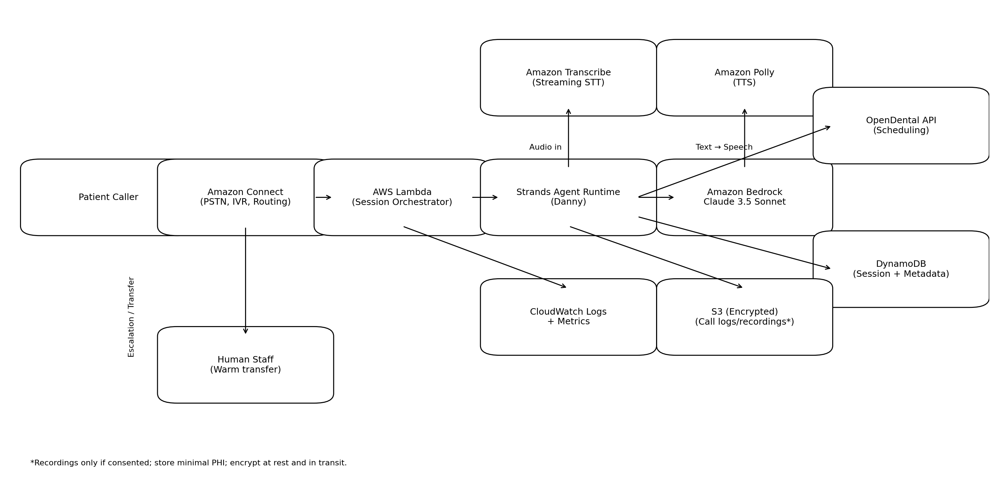

# DentAI Concierge MVP Design Document

## Executive Summary

DentAI Concierge aims to give dental practices a **HIPAA‑compliant, human‑parity AI voice assistant** (named **Danny**) that answers phone calls, schedules patients, performs insurance eligibility checks and escalates to a person when needed.  The Business Requirements Document (BRD) provided by Spiritus Agentic Solutions highlighted enormous waste in the dental industry due to missed appointments, manual insurance verification and poor patient communication.  To address these problems quickly and economically, we will build a **Minimum Viable Product (MVP)** using the **Strands agent framework** on AWS, with **Claude 3.5 Sonnet** as the reasoning model.  Strands is an open‑source SDK for building agents; it supports *model‑agnostic voice interactions* and includes a **bidirectional streaming (BidiAgent)** interface so the agent can listen and speak at the same time【598666232986070†L255-L276】.  Leveraging Strands allows us to focus on workflow orchestration while keeping the core logic portable.

The MVP will concentrate on the following high‑value capabilities:

* **Intelligent Inbound Reception** – answer calls within one ring, greet patients by name, and capture the purpose of the call.
* **Appointment Booking** – query the practice management system (PMS) calendar (OpenDental) and book an appointment or place the caller on a waitlist.
* **Basic Insurance Eligibility Check** – perform a real‑time eligibility lookup via a stubbed integration (optionally Availity or DentalXChange) to quote coverage and co‑pays, or collect the necessary details for a human to verify offline.
* **Bilingual Conversational Agent** – support English and Spanish using open‑source speech recognition and synthesis models.
* **Human Escalation** – transfer the call to office staff when the patient requests a person or when the agent encounters a clinical or billing question it cannot answer.
* **Compliance** – record consent, log calls securely and ensure that **no medical advice** is given (aligned with ADA and HIPAA guidelines).

Features such as outbound recall campaigns, digital intake forms, advanced payment collection and full analytics will be deferred to later phases.  Focusing on inbound reception and scheduling will enable us to get a product into pilot practices within **four weeks**, validate real‑world voice interactions, and demonstrate cost savings.

## Goals and Scope

### Goals

1. **Answer 100 % of incoming phone calls with human‑like quality.**
2. **Reduce administrative time** by automatically booking appointments and pre‑filling patient information into the PMS.
3. **Provide basic insurance eligibility information** during the call, reducing surprises at the front desk.
4. **Ensure compliance** with HIPAA, TCPA, ADA and state recording laws; record and store calls securely.
5. **Minimise cost** by using free or open‑source components wherever possible while maintaining reliability.

### Out‑of‑Scope for MVP

* Digital intake forms and medical history questionnaires (Phase 4 of the BRD).
* In‑call payment collection and advanced analytics (Phase 5).
* Multi‑practice DSO dashboards, white‑labelling and custom CRM integrations (Phase 6).
* Support for more than two languages (we will deliver English and Spanish only in MVP).

## Architecture Overview

The MVP architecture separates the system into modular agents and services.  Strands provides the **agent runtime** and manages tool invocation and conversation state【598666232986070†L255-L276】.  For voice handling we combine a **telephony bridge** with **speech‑to‑speech models** so the agent can listen and speak simultaneously.  The data flow is designed to meet HIPAA requirements and to isolate Protected Health Information (PHI) within secure storage.  An overview of the architecture is illustrated below.

**AWS-first MVP note:** To keep the MVP inside AWS (including voice), we use **Amazon Connect** for inbound PSTN and routing, **Amazon Transcribe (streaming)** for speech-to-text, **Amazon Polly** for text-to-speech, and **Amazon Bedrock (Claude 3.5 Sonnet)** for reasoning. The Strands runtime hosts the agent **Danny** and invokes tools (OpenDental, persistence, logging) through controlled interfaces.

### Component Descriptions

| Component | Role |
|---|---|
| **Telephony** | **Amazon Connect** provides the patient-facing phone number, inbound routing, and warm transfer to a human queue/agent. |
| **Live Audio Streaming** | Amazon Connect can stream customer audio to **Amazon Kinesis Video Streams (KVS)** using the *Start media streaming* flow block. A lightweight consumer (based on AWS’s Connect KVS consumer demo) parses audio fragments for near-real-time processing. |
| **Strands Voice Agent (Danny)** | Core orchestrator built with the Strands SDK. Danny manages state, error handling, guardrails (no medical advice), and tool invocation. |
| **Speech (STT/TTS)** | **Amazon Transcribe (streaming)** converts caller audio to text; **Amazon Polly** speaks the assistant’s responses back to the caller via Connect prompts/audio playback. |
| **LLM / Dialogue Model** | **Claude 3.5 Sonnet** running on **Amazon Bedrock** generates responses and decides when to call tools (scheduling, FAQ, escalation). |
| **PMS Integration Tool** | A Strands tool that interfaces with **OpenDental’s REST API** to search provider schedules, book appointments and create new patient records.  OpenDental offers an accessible API for integration. |
| **Insurance Verification Tool** | A Strands tool that queries an **eligibility API** (Availity or DentalXChange).  Because these APIs are not free, the MVP will provide a **mock/stub** that looks up coverage based on preloaded plan information. |
| **Database** | **DynamoDB** stores session state, consent flags, minimal call metadata, and integration logs (encrypted + least-privilege). |
| **Secure Storage** | **S3** stores call transcripts/recordings *only when consented* (KMS encryption; retention policy). |
| **Compliance & Logging Agent** | A Strands tool responsible for prompting the caller for consent, logging every tool call and auditing all data access.  It ensures we follow HIPAA, TCPA and ADA guidelines.  Call recordings are saved only after consent; transcripts are redacted for PHI before analytics. |
| **Human Escalation** | When Danny encounters a request outside scope (clinical, distressed patient, complex billing) or the caller asks for a person, **Amazon Connect** performs a warm transfer to the office queue/agent and attaches a short AI summary as contact attributes. |

### Data Flow

1. **Call Setup:** A patient dials the practice’s number. **Amazon Connect** receives the call, plays the AI disclosure/consent prompt, and starts live media streaming.
2. **Voice Streaming:** Connect streams the customer audio to **Kinesis Video Streams**. A small consumer service reads the stream and feeds audio into **Amazon Transcribe streaming**; Danny receives the transcript in near real time.
3. **Agent Processing:** Danny calls **Claude 3.5 Sonnet (Bedrock)** with the transcript + conversation state. The model decides whether to call tools (OpenDental scheduling, FAQ knowledge, insurance stub) and returns a structured action plan.
4. **Response Playback:** Danny generates a response. **Amazon Polly** synthesizes the text to speech, and Connect plays it to the caller (turn-based MVP).
5. **Data Persistence:** Minimal call metadata (consent, intent, outcomes, timestamps) is stored in **DynamoDB**; transcripts/recordings (if consented) are stored in **S3** with KMS encryption and retention rules. All tool calls and data access are logged to **CloudWatch**.
6. **Escalation:** If the call is too complex or the caller requests a person, the agent triggers a warm transfer to office staff, passing along summary context and any gathered data.

## Technology Choices & Cost Optimisation

Our goal for the 4-week MVP is to stay **AWS-first**, minimize custom infrastructure, and use free tiers/credits where possible.

1. **Strands SDK** - production-ready agent runtime; open-source and model-agnostic. We use it to implement Danny's orchestration and tool calling.
2. **Voice inside AWS** - **Amazon Connect** (telephony, routing, warm transfer) + **Amazon Transcribe Streaming** (STT) + **Amazon Polly** (TTS). This avoids operating real-time speech stacks and keeps PHI inside AWS.
3. **LLM** - **Claude 3.5 Sonnet on Amazon Bedrock** for high conversational quality and strong tool planning.
4. **PMS Integration** - start with **OpenDental REST API** only (search slots, book appointment, create/update patient).
5. **Insurance (MVP)** - implement a configurable **mock/stub** eligibility service so we can test scripts and patient experience without clearinghouse costs. Real-time eligibility is Phase 3.
6. **Serverless core** - Lambda for orchestration hooks, DynamoDB for session state/consent, S3 for transcripts/recordings (consent-based), CloudWatch for logs/metrics.

## Cost Estimate (MVP, Example)

This is a **back-of-the-envelope** estimate to understand order-of-magnitude costs for an MVP practice.

**Assumptions (editable):**
* 2,500 inbound minutes/month
* 500 calls/month (avg 5 minutes)
* Claude usage ~ 1,500 input tokens + 750 output tokens per call
* Polly uses neural voices (~800 characters per minute of spoken output)

### Unit pricing inputs
* Amazon Connect inbound voice: $0.018 per minute (US) (excludes phone number and carrier PSTN fees)
* Amazon Transcribe streaming: $0.024 per minute (tier 1)
* Amazon Polly neural: $16 per 1M characters (with a 1M character/month free tier for first 12 months)
* Amazon Bedrock Claude 3.5 Sonnet: $0.006 per 1K input tokens, $0.030 per 1K output tokens

### Monthly cost example (2,500 min)
* **Connect:** 2,500 * 0.018 = **$45.00**
* **Transcribe:** 2,500 * 0.024 = **$60.00**
* **Polly (neural):** 2,500 min * 800 chars/min = 2,000,000 chars => **$32.00** (or **$16.00** with the 1M free tier)
* **Claude 3.5 Sonnet:** (500 calls * 1,500 in = 750K in) + (500 calls * 750 out = 375K out)
  * input: 750K/1K * 0.006 = $4.50
  * output: 375K/1K * 0.030 = $11.25
  * **LLM total:** **$15.75**
* **Infra (Lambda, DynamoDB, S3, CloudWatch):** typically **<$10** for MVP volumes

**Estimated total (excluding phone number/carrier charges):** ~ **$137/mo** (or **~$121/mo** during Polly free tier)

> Note: Real-world cost depends heavily on call volumes, average call duration, voice region/PSTN, and how verbose Danny is (tokens).

## Workflows

### New Patient Appointment
1. **Caller dials practice number.**  Amazon Connect answers within one ring and connects the call to the Strands agent.
2. **Consent & greeting.**  The agent states its identity and obtains consent for recording (TCPA and ADA compliance).
3. **Intent capture.**  The caller says “I’d like to schedule a cleaning.”  The agent uses the LLM to recognise the intent.
4. **Patient identification.**  Caller ID or verbal prompts capture the patient’s name and date of birth.  The agent queries the PMS to see if the patient exists; if not, it gathers minimal new patient information.
5. **Scheduling.**  The agent calls the PMS integration tool to pull available slots for the requested provider or service.  It offers times, books the chosen slot and sends a confirmation via SMS (if configured).
6. **Insurance check.**  If the caller asks about coverage, the agent invokes the insurance tool to provide a co‑pay estimate based on the stubbed plan data.
7. **Wrap‑up.**  The agent summarises the appointment, reminds the patient of any pre‑appointment instructions and offers to answer further questions.
8. **Data persistence & logging.**  Call details are stored; if the patient requested a human, the call is transferred.

### Insurance Eligibility Inquiry
1. Caller requests to know what their plan covers for a procedure (e.g., crown).  The agent collects plan ID and procedure code.
2. The insurance tool looks up coverage in the stubbed file (or Availity if integrated) and returns deductible remaining, percentage coverage and estimated co‑pay.
3. The agent communicates the estimate clearly to the caller.  If the plan is not found or the request is too complex, the agent escalates to staff.

### Warm Transfer
1. The caller says “I’d like to speak to a person,” or the agent determines the question is beyond its scope.
2. The agent uses Twilio’s API to call an internal extension and announces the transfer.  It summarises the conversation so far.
3. When a staff member answers, the agent connects the calls and gracefully leaves the conversation.

## Project Timeline (4 Weeks)

| Week | Milestone | Key Activities |
|---|---|---|
| **Week 1** | **Foundation & Telephony Integration** | Set up AWS accounts; deploy Strands agent runtime on an EC2 instance; configure Twilio or Asterisk SIP trunk; implement media streaming bridge; integrate Whisper/Coqui for STT/TTS; implement basic call flow that answers calls, introduces itself and echoes back input. |
| **Week 2** | **Dialogue & Scheduling** | Fine‑tune LLM (LLaMA/Mistral) on dental transcripts; implement appointment‑booking tool using OpenDental’s API; add patient identification; test booking flows; start building compliance prompts. |
| **Week 3** | **Insurance Stub & Bilingual Support** | Build stub insurance verification tool; design data model and PostgreSQL schema for calls and appointments; implement Spanish language support by switching STT/TTS models and adding translation layer; harden compliance agent (consent and logging). |
| **Week 4** | **End‑to‑End Testing & Deployment** | Conduct integration testing across call scenarios; implement warm‑transfer flow; configure S3 bucket with encryption and lifecycle policies; perform security review (HIPAA/TCPA); document SOPs for practice staff; prepare for pilot deployment in selected North Carolina practices. |

## Risk Assessment & Mitigation

| Risk | Likelihood | Mitigation |
|---|---|---|
| **PMS API delays or lack of access** | Medium | Start integration with **OpenDental** (open API) and build an abstraction layer so other PMS (Dentrix/Eaglesoft) can be added later. |
| **Quality of open‑source speech models** | Medium | Test multiple STT/TTS models; ensure clarity for dental terminology; if quality is insufficient, allocate budget for commercial models like Amazon Nova Sonic which are supported by Strands【598666232986070†L255-L276】. |
| **LLM hallucinations and misinformation** | Medium | Constrain the agent’s response style; include guardrails to avoid clinical advice; monitor transcripts; fallback to warm transfer when uncertain. |
| **Insurance data inaccuracies** | High | Use a stub for MVP; clearly communicate estimates as unofficial; plan integration with Availity/DentalXChange post‑pilot. |
| **TCPA/State law violations** | Medium | Ensure call recording and dialing rules follow state laws; implement consent prompts; restrict calling hours. |
| **Latency** | Low | Hosting STT/TTS and LLM on the same EC2 instance reduces network hops; Strands BidiAgent supports full‑duplex streaming for sub‑500 ms latency【598666232986070†L255-L276】. |

## Conclusion

By leveraging **Strands’ open‑source agent framework** and deploying free or low‑cost components, the DentAI Concierge MVP can be built quickly and economically.  The architecture emphasises clear agent boundaries, minimal coupling and compliance by design.  The four‑week plan prioritises inbound reception, scheduling and basic insurance checks—capabilities that deliver immediate value to dental practices.  Once validated, the same modular framework can be extended to incorporate outbound campaigns, digital intake forms, payments and multi‑location analytics.
